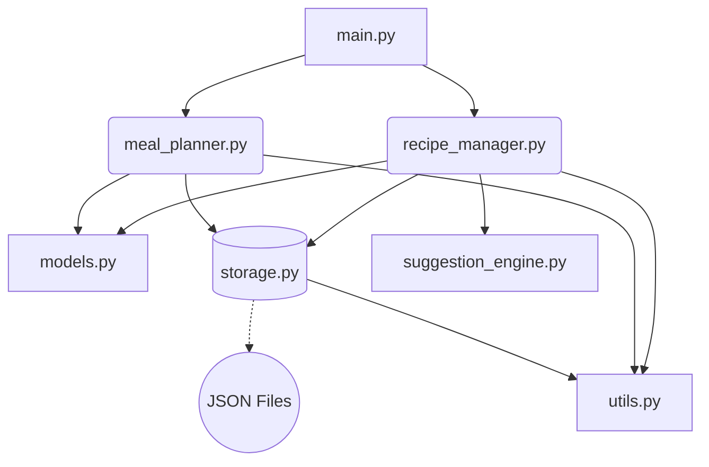
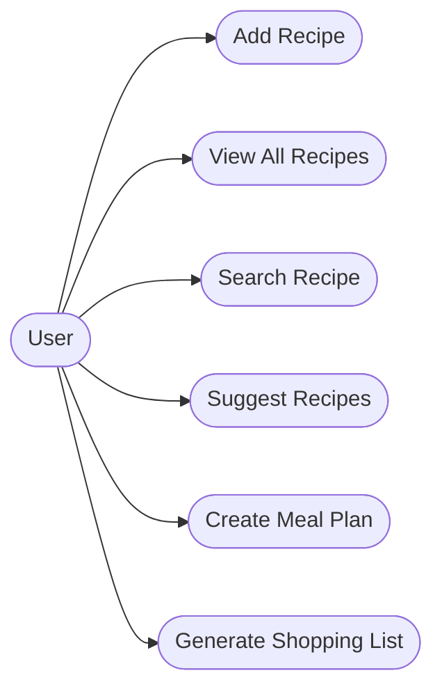
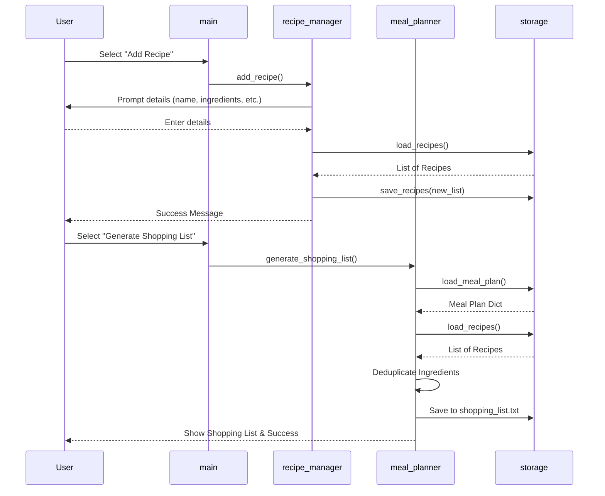
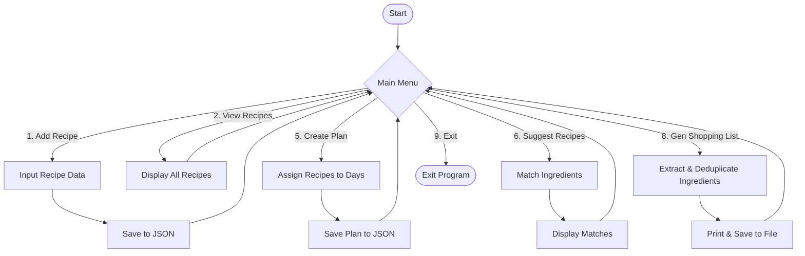

# CLI Recipe Manager & Meal Planner: Project Report

## 1. Introduction
The **CLI Recipe Manager & Meal Planner** is a terminal-based application designed to help users efficiently manage their recipes, organize weekly meal plans, and generate consolidated shopping lists. Developed strictly with the Python Standard Library, this lightweight tool offers high performance, reliability, and persistent data storage via JSON without any external dependencies.

## 2. Requirements & MVP Scope
### Must-Have Features (MVP)
- **Recipe Management:** Add, view, search, and view detailed information for recipes.
- **Suggestion Engine:** Intelligently suggest recipes based on available ingredients, showing match percentages.
- **Meal Planning:** Assign recipes to a 7-day meal plan.
- **Shopping List Generation:** Combine and deduplicate ingredients based on the selected meal plan.
- **Persistent Data Storage:** Save state locally using JSON files.

### Non-Functional Requirements
1. **Usability:** A clear, numbered menu system guiding user interactions with feedback on success/failure.
2. **Reliability:** Comprehensive input validation to prevent crashes due to invalid input types or logic errors.
3. **Maintainability:** Modular architecture dividing responsibilities across various files (e.g., `models.py`, `storage.py`, `utils.py`).
4. **Data Persistence:** Automatic data syncing to disk upon state changes ensuring data isn't lost.
5. **Error Handling:** Graceful recovery during events like missing files or incorrectly formatted data.

## 3. Diagrams & Architecture

### 3.1 System Architecture Diagram
The system is divided into functional modules keeping concerns separated.

### 3.2 Use Case Diagram
User interactions with the core functionalities.

### 3.3 Sequence Diagram
Sequence covering "Add Recipe" and "Generate Shopping List".

### 3.4 Workflow / Process Diagram
Flowchart detailing the overall logic.

## 4. Technical Implementation details
- **Language:** Python 3.8+
- **Database/Storage:** Flat JSON files (`data/recipes.json`, `data/meal_plan.json`).
- **Data Classes:** Leveraging Python `dataclasses` for representing `Recipe` models elegantly.
- **Logging:** Implemented via standard `logging` library mapping outputs to `app.log`.

## 5. Conclusion
The CLI Recipe Manager successfully acts as a streamlined and resilient tool covering all requested MVP constraints without introducing unnecessary software bloat.
